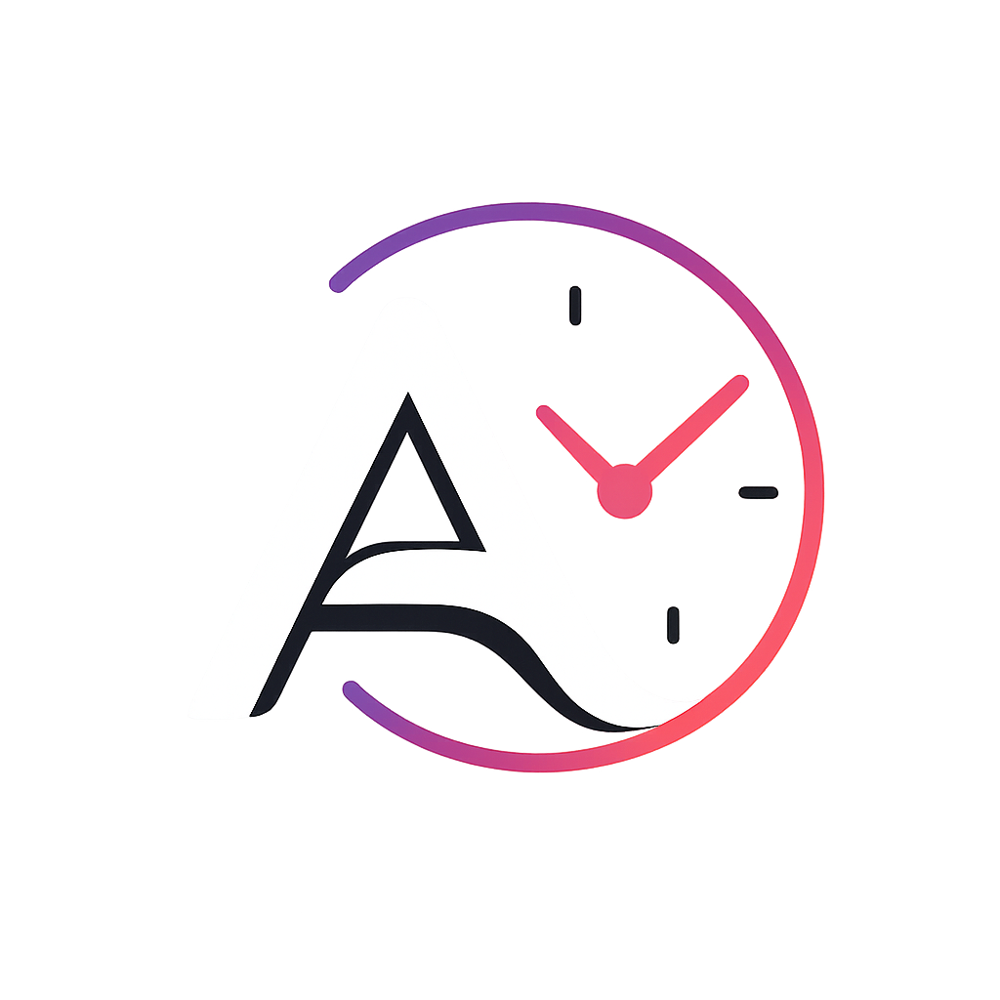

<div align="center">





# AshClock <p align="center">
</p>

### AshClock is a minimalist Rainmeter skin that brings a clean, elegant, and distraction-free clock to your Windows desktop.


</div>


## 🚀 Quick Start

1. Install Rainmeter.
2. Download AshClock.
3. Copy it to `Documents/Rainmeter/Skins`.
4. Refresh Rainmeter.
5. Load `AshClock.ini`.

You're ready to go!
---

## ✨ Features

- 🕒 Large minimalist digital clock
- 🎨 Clean, modern desktop aesthetic
- 🌸 Accent-colored weekday display
- 🖥️ Transparent Rainmeter widget
- ⚡ Lightweight and performance-friendly
- 🎯 Optimized for desktop wallpapers
- 🪟 Designed for Windows 11
- 📦 Open Source

---

## 📸 Close-up


---

## 🎯 Design Philosophy

AshClock is built around four simple principles.

- Minimal
- Elegant
- Lightweight
- Customizable


## 📦 Installation

### 1. Install Rainmeter

Download and install the latest version of Rainmeter.

### 2. Download AshClock

Clone this repository or download the latest release.

### 3. Install

Copy the AshClock folder into:

```text
Documents/Rainmeter/Skins
```

### 4. Refresh Rainmeter

Right-click the Rainmeter tray icon

↓

Refresh all

↓

Load AshClock.ini

Enjoy! 🎉

---

## 📂 Project Structure

```text
AshClock/
│
├── @Resources/
│   ├── Fonts/
│   ├── Styles.inc
│   └── Variables.inc
│
├── preview/
│   ├── AshClock_logo.png
│   ├── desktop-preview.png
│   └── closeup.png
│
├── .gitignore
├── AshClock.ini
├── CHANGELOG.md
├── CONTRIBUTING.md
├── LICENSE
└── README.md
```

---

## 🛣️ Roadmap

- ✅ v1.0 – Initial Release
- 🔄 v1.1 – Layout improvements
- 🎨 v1.2 – Theme customization
- ⚙️ v1.3 – Settings panel
- 🌦️ v1.4 – Weather widget
- 🔋 v1.5 – Battery widget
- 🚀 v2.0 – Modular widget ecosystem

---

## 🤝 Contributing

Contributions, issues, and feature requests are welcome!

If you discover a bug or have a feature request, please open an Issue in this repository.

Contributions are always welcome.

---

## 📄 License

This project is licensed under the MIT License.

---


<div align="center">

Designed and developed by **Ashish Dubey**

If you like AshClock, consider giving this repository a ⭐.

</div>